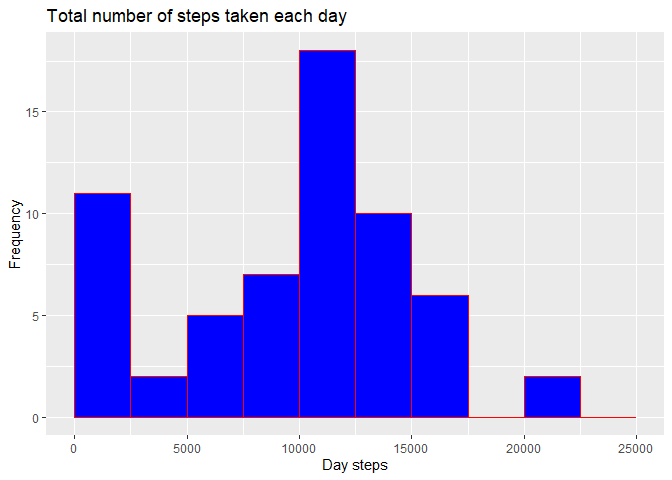
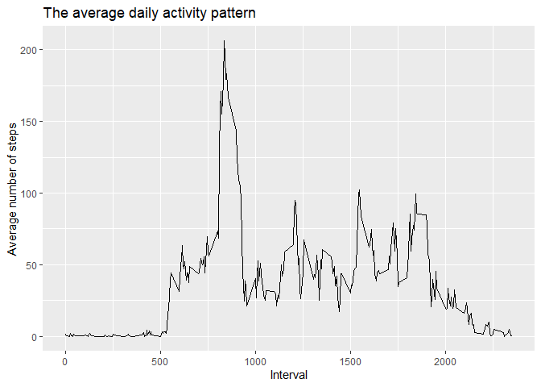
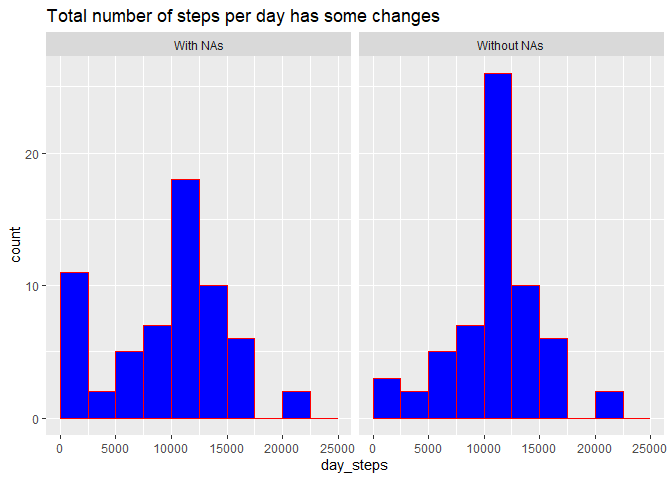
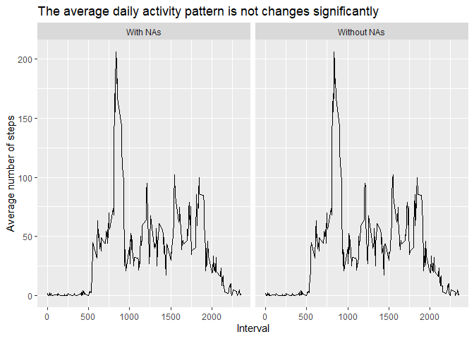
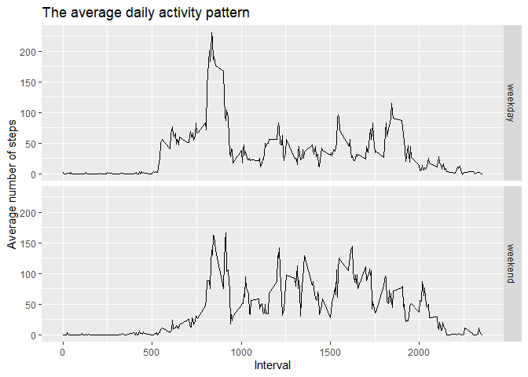

## Loading the data
Loading data with standard function *read.csv*.
Loading library *Tidyverse* for operations with data frames and visualisations.


```r
library (tidyverse)
if (!exists("activity.csv")) unzip ("activity.zip")
data<-read.csv ("activity.csv")
```

## What is mean and median of total number of steps taken per day?
Proceeding data with function *summarise* and making histogram

```r
per_day<-summarise (group_by(data,date), day_steps=sum(steps,na.rm = TRUE))
print (paste("The mean is",mean(per_day$day_steps,na.rm = TRUE)))
```

```
## [1] "The mean is 9354.22950819672"
```

```r
print (paste("The median is",median(per_day$day_steps,na.rm=TRUE)))
```

```
## [1] "The median is 10395"
```

# Histogram of the total number of steps taken each day

```r
pl1<-ggplot(per_day,aes(x=day_steps))
pl1+geom_histogram(breaks = seq(0, 25000, by=2500),col="red",fill="blue")+
  labs (title="Total number of steps taken each day", y="Frequency",
        x="Day steps")
```

<!-- -->


## What is the average daily activity pattern?

# Plot of daily activity pattern

```r
per_interval<-summarise (group_by(data,interval), i_steps=mean(steps,na.rm = TRUE))
pl2<-ggplot(per_interval,aes(x=interval,y=i_steps))
pl2+geom_line()+labs (title="The average daily activity pattern", x= "Interval",
                      y="Average number of steps")
```

<!-- -->

# Which 5-minute interval, on average across all the days in the dataset, contains the maximum number of steps?

```r
print (paste ("Maximum activity interval - ", 
              per_interval[which.max(per_interval$i_steps), ]$interval))
```

```
## [1] "Maximum activity interval -  835"
```

## Imputing missing values

Calculate and report the total number of missing values in the dataset (i.e. the total number of rows with \color{red}{\verb|NA|}NAs)

```r
print (sum(is.na(data$steps)))
```

```
## [1] 2304
```

Let`s use mean of 5-minute intervals for filling the missing values.  
Creating a new dataset **data2** with the missing data filled in.

```r
data2<-data
for (i in 1:nrow(data2))
{
  if (is.na(data2$steps[i])) 
    data2$steps[i]<-
      per_interval$i_steps[per_interval$interval==data2$interval[i]]
}
```
Comparing datasets with and without NAs


```r
per_day$type<-"With NAs"
per_day2<-summarise (group_by(data2,date), day_steps=sum(steps,na.rm = TRUE))
per_day2$type<-"Without NAs"
per_day3<-rbind (per_day,per_day2)

print (paste("The mean with NAs is",mean(per_day$day_steps,na.rm = TRUE)))
```

```
## [1] "The mean with NAs is 9354.22950819672"
```

```r
print (paste("The mean without NAs is",mean(per_day2$day_steps,na.rm = TRUE)))
```

```
## [1] "The mean without NAs is 10766.1886792453"
```

```r
print (paste("The median with NAs is",median(per_day$day_steps,na.rm=TRUE)))
```

```
## [1] "The median with NAs is 10395"
```

```r
print (paste("The median without NAs is",median(per_day2$day_steps,na.rm=TRUE)))
```

```
## [1] "The median without NAs is 10766.1886792453"
```

Let`s visualize the differences.

```r
pl3<-ggplot(per_day3,aes(x=day_steps))
pl3+geom_histogram(breaks = seq(0, 25000, by=2500),col="red",fill="blue")+
  facet_grid(.~type)+labs(title = "Total number of steps per day has some changes")
```

<!-- -->


Because of chosen strategy of filling missing values daily activity pattern is not changed

```r
per_interval$type<-"With NAs"
per_interval2<-summarise (group_by(data2,interval), 
                          i_steps=mean(steps,na.rm = TRUE))
per_interval2$type<-"Without NAs"
per_interval3<-rbind(per_interval,per_interval2)

pl4<-ggplot(per_interval3,aes(x=interval,y=i_steps))
pl4+geom_line()+labs (title="The average daily activity pattern is not changes significantly", x= "Interval",
                      y="Average number of steps")+facet_grid(.~type)
```

<!-- -->

## Are there differences in activity patterns between weekdays and weekends?

At first let`s add the new variable *weekday* to data frame *data2*.
By using function *weekdays* we define weekdays and weekends.
*Sys.setlocale* makes our script independent from local settings on current computer.

```r
Sys.setlocale(category = "LC_ALL", locale = "English_United States.1252")
```

```
## [1] "LC_COLLATE=English_United States.1252;LC_CTYPE=English_United States.1252;LC_MONETARY=English_United States.1252;LC_NUMERIC=C;LC_TIME=English_United States.1252"
```

```r
data2$date<-as.POSIXct(data2$date, "%Y%m%d")
data2$weekday<-"weekday"
data2$weekday[weekdays(data2$date)=="Saturday"|weekdays(data2$date)=="Sunday"]<-"weekend"
print (paste ("Mean of steps on weekdays is ", mean(data2$steps[data2$weekday=="weekday"])))
```

```
## [1] "Mean of steps on weekdays is  35.6105811786629"
```

```r
print (paste ("Mean of steps on weekends is ", mean(data2$steps[data2$weekday=="weekend"])))
```

```
## [1] "Mean of steps on weekends is  42.366401336478"
```
Last step is making plot


```r
per_interval_w<-summarise (group_by(data2,interval,weekday), 
                          i_steps=mean(steps,na.rm = TRUE))
pl5<-ggplot(per_interval_w,aes(x=interval,y=i_steps))
pl5+geom_line()+labs (title="The average daily activity pattern", x= "Interval",
                      y="Average number of steps")+facet_grid(weekday~.)
```

<!-- -->


As we can see on weekends mean of activity is higher, but has more plain distribution

